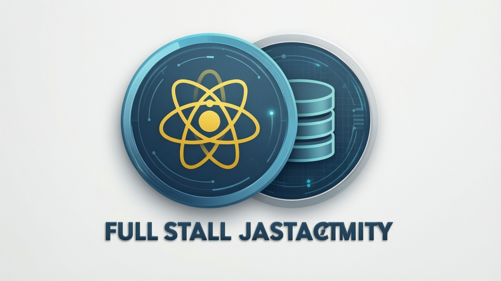
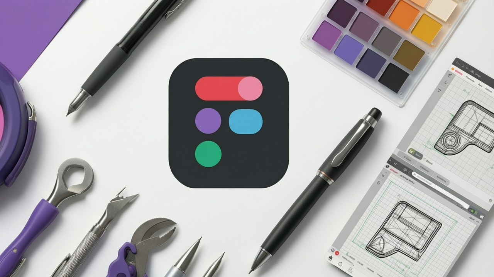
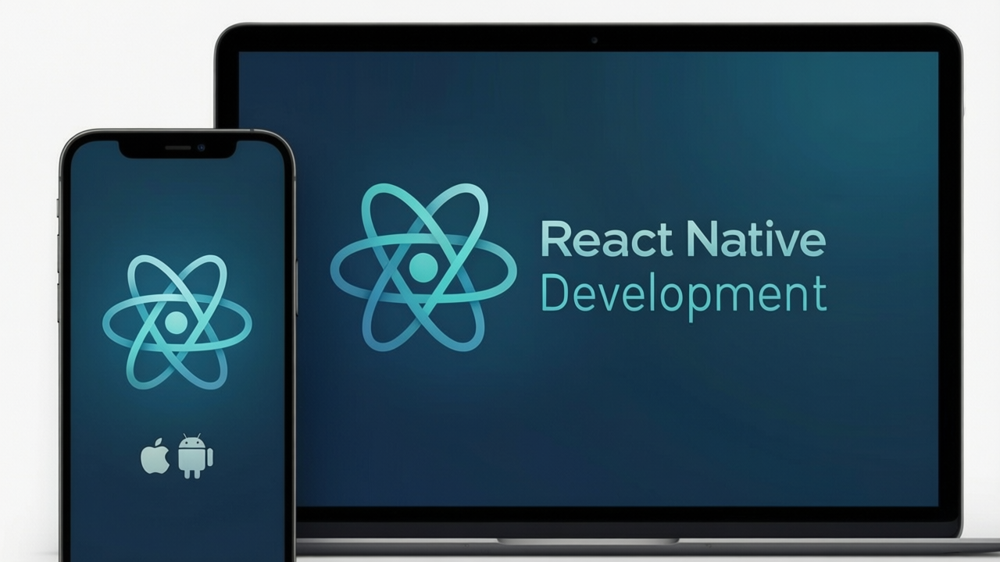

# Courses - Browse Catalog

**URL:** https://leartech-solutions.com/courses

---

## Browse Our Course Catalog

Explore 500+ courses and start learning today. Filter by category, difficulty, and price to find the perfect course for you.

---

## Featured Courses

### Python for Data Science

**Instructor:** Dr. Sarah Johnson  
**Level:** Beginner  
**Duration:** 12 hours (42 lessons)  
**Price:** $89  
**Rating:** ⭐ 4.8 (2,341 reviews)

**Description:** Learn Python programming fundamentals and apply them to data science projects. Perfect for beginners with no prior programming experience.

**What You'll Learn:**
- Python syntax and data structures
- Data manipulation with pandas
- Data visualization with matplotlib
- Introduction to machine learning

[Enroll Now](/courses/python-data-science)

---

### Full Stack JavaScript

**Instructor:** Mike Chen  
**Level:** Intermediate  
**Duration:** 24 hours (68 lessons)  
**Price:** $129  
**Rating:** ⭐ 4.7 (1,892 reviews)

**Description:** Master modern web development with JavaScript. Build complete applications from frontend to backend.

**What You'll Learn:**
- React and modern frontend development
- Node.js and Express backend
- Database integration with MongoDB
- Authentication and authorization

[Enroll Now](/courses/fullstack-js)

---

### Machine Learning A-Z

**Instructor:** Dr. James Liu  
**Level:** Advanced  
**Duration:** 18 hours (55 lessons)  
**Price:** $149  
**Rating:** ⭐ 4.9 (3,156 reviews)

**Description:** Comprehensive machine learning course covering supervised and unsupervised learning algorithms.

**What You'll Learn:**
- Regression and classification
- Neural networks and deep learning
- Clustering and dimensionality reduction
- Model evaluation and optimization

[Enroll Now](/courses/ml-az)

---

### UI/UX Design Masterclass

**Instructor:** Emma Wilson  
**Level:** Beginner  
**Duration:** 10 hours (36 lessons)  
**Price:** $79  
**Rating:** ⭐ 4.6 (1,234 reviews)

**Description:** Learn to design beautiful and functional user interfaces and experiences.

**What You'll Learn:**
- Design principles and typography
- Wireframing and prototyping
- User research methods
- Design tools (Figma, Sketch)

[Enroll Now](/courses/ui-ux-design)

---

### React Native Development

**Instructor:** Alex Kumar  
**Level:** Intermediate  
**Duration:** 15 hours (48 lessons)  
**Price:** $109  
**Rating:** ⭐ 4.7 (987 reviews)

**Description:** Build cross-platform mobile apps with React Native.

**What You'll Learn:**
- React Native fundamentals
- Navigation and state management
- Native device features
- App deployment to App Store and Play Store

[Enroll Now](/courses/react-native)

---

### Startup Fundamentals

**Instructor:** Lisa Park  
**Level:** Beginner  
**Duration:** 8 hours (28 lessons)  
**Price:** $69  
**Rating:** ⭐ 4.5 (756 reviews)

**Description:** Learn the essentials of starting and growing a successful startup.

**What You'll Learn:**
- Business model development
- Market research and validation
- Fundraising strategies
- Team building and management

[Enroll Now](/courses/startup-fundamentals)

---

## Filter Courses

### By Category
- Programming (150 courses)
- Data Science (85 courses)
- Design (60 courses)
- Business (75 courses)
- Marketing (50 courses)
- Personal Development (83 courses)

### By Difficulty
- Beginner (200 courses)
- Intermediate (200 courses)
- Advanced (123 courses)

### By Price
- Free (50 courses)
- Under $50 (150 courses)
- $50 - $100 (200 courses)
- $100+ (123 courses)

### By Rating
- 4.5+ stars (300 courses)
- 4.0+ stars (450 courses)
- 3.5+ stars (500+ courses)

---

## Course Categories

### Programming
Learn languages like Python, JavaScript, Java, Go, and more. Build real-world projects and strengthen your coding skills.

### Data Science & AI
Master data analysis, machine learning, artificial intelligence, and statistical methods.

### Design & Creative
Develop skills in UI/UX design, graphic design, video editing, and creative tools.

### Business & Entrepreneurship
Learn business strategy, marketing, finance, and startup fundamentals.

---

*Showing 1-6 of 523 courses*  
[View All Courses](/courses/all)
