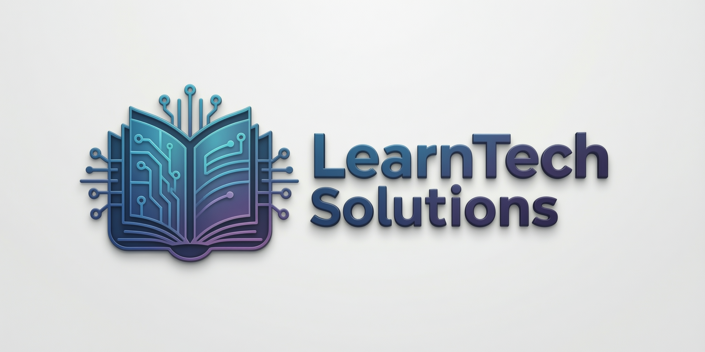
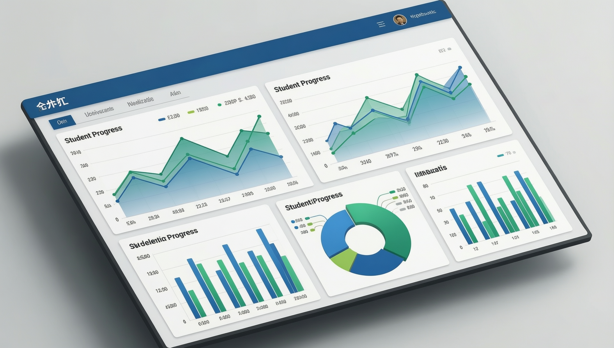
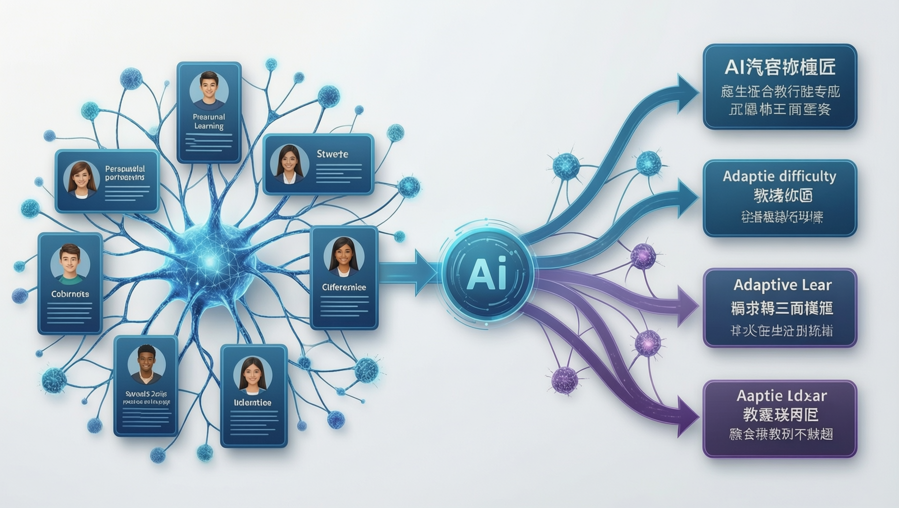

# LearnTech Solutions - Home

**URL:** https://leartech-solutions.com

---

## Welcome to LearnTech Solutions

**Personalized Learning for Everyone**

Transform your education with AI-powered adaptive learning technology that personalizes the learning experience for every student.

---

## About Us

LearnTech Solutions is an educational technology company specializing in adaptive learning platforms and online course management. Founded in 2019, we are dedicated to democratizing education through personalized learning experiences.

### Our Mission
To democratize education through adaptive learning technology that personalizes the learning experience for every student.

---

## Key Statistics

| Metric | Value |
|--------|-------|
| Active Students | 50,000+ |
| Courses Available | 500+ |
| Verified Instructors | 200+ |
| Completion Rate | 75% |
| Average Rating | 4.7/5 |

---

## Our Products

### Course Platform

A complete learning management system for creating and delivering online courses.

**Features:**
- Interactive video player
- Quiz and assessment builder
- Progress tracking
- Certificate generation
- Mobile app support

### Learning Analytics

Data-driven insights into student performance and engagement.

**Features:**
- Real-time dashboards
- Student progress tracking
- Predictive analytics
- Engagement metrics
- A/B testing framework

### Adaptive Learning

AI-powered personalization that adapts to each student's needs.

**Features:**
- Student profiling
- Knowledge tracing
- Intelligent recommendations
- Dynamic difficulty adjustment

---

## Why Choose LearnTech?

1. **Personalized Learning** - Adaptive technology that adjusts to each student's pace and learning style
2. **Advanced Analytics** - Comprehensive insights into student performance and engagement metrics
3. **Mobile First** - Learn anywhere, anytime with our native iOS and Android applications
4. **Secure Platform** - Enterprise-grade security with SOC 2 compliance and data encryption
5. **Global Reach** - Support for multiple languages and international payment methods
6. **24/7 Support** - Dedicated support team ready to help you succeed

---

## Get Started

### For Students
Browse our catalog of 500+ courses and start learning today.

[Sign Up Free](/signup) | [Browse Courses](/courses)

### For Instructors
Share your expertise and earn money teaching online. Keep 70% of every sale.

[Become an Instructor](/instructors/apply)

---

## Contact Information

**LearnTech Solutions**
123 Innovation Drive
San Francisco, CA 94105

- Email: contact@leartech-solutions.com
- Phone: +1 (555) 123-4567
- Twitter: @LearnTechSol
- LinkedIn: /company/leartech-solutions

---

*© 2024 LearnTech Solutions. All rights reserved.*
